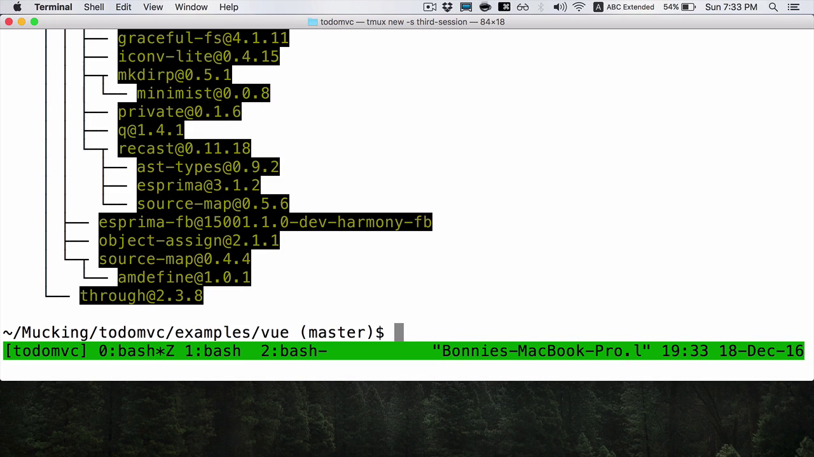
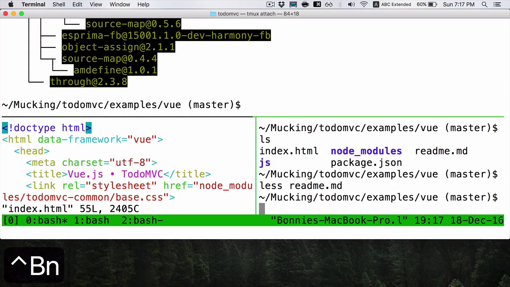
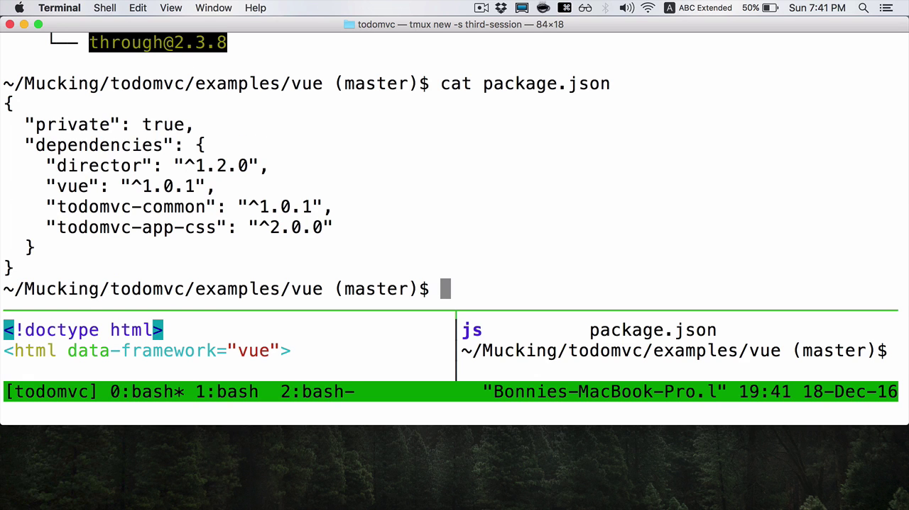
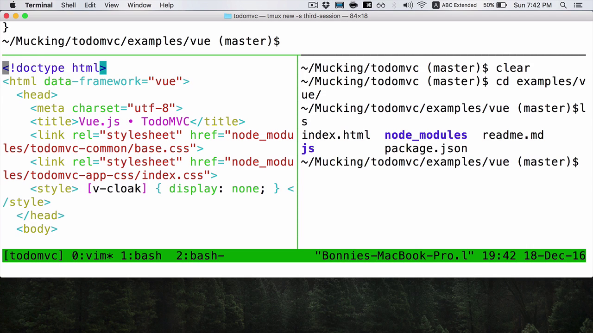
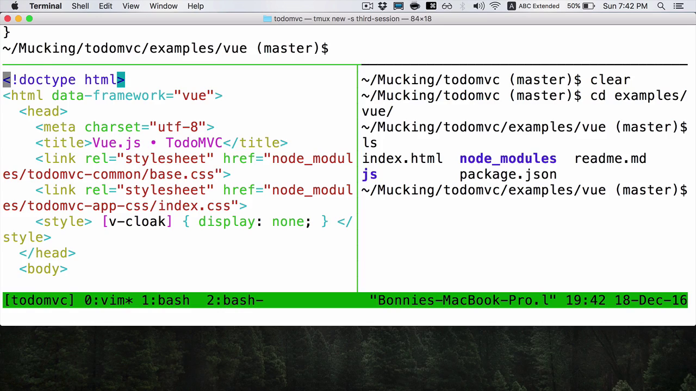
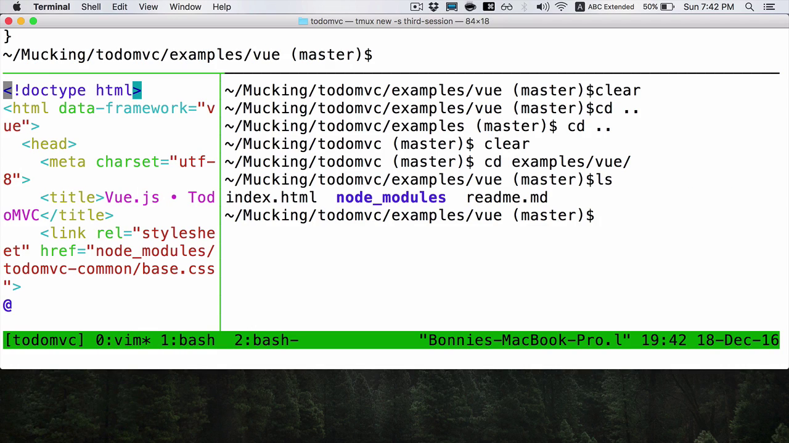

We're working within this Vue.js example, we might find that we want to focus on a particular pane within our tmux session. We can do this with `Control+B` and then `z` for zoom.

I can work within this pane as normal, but don't worry, all of my other panes are still there. If I type `Control+B` and then `Z` again, I'll zoom back out, and now, I have all of my panes back.

If you want to resize your panes, we go a little bit less all or nothing. tmux also provides you with controls for doing that. We can type `Control+B` and then `:`, and get into this command mode.

From here, we can type `resize-pane`, with a hyphen, and then `-D` will resize that pane downwards.

In case that wasn't dramatic enough for you, we can also specify how much we should we resize a pane. Again, `Control+B :` to get into command mode, then `resize-pane -D`, and now, we can provide a size. For example, `30` will bring us downwards by 30 cells.

Now, I use `Control+B` and then the down arrow key to move into the lower pane. Similarly, I can do `Control+B :`, and then `resize-pane -U` to go upwards, and let's go up by `80`.

Now, you can see that we can also go upwards. Same goes for left and right. `Control+B :`, `resize-pane -R` pushes just a little bit to the right.

Finally, `Control+B :`, `resize-pane -L` brings us to the left.

It's up, down, left, and right, are your options for the flags passed to resize-pane.