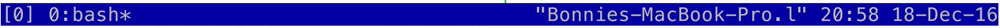

You can modify tmux's default behavior by editing your tmux configuration file, which we can do by editing the .tmux.conf file in your home directory.

The first modification we're going to make is changing the prefix key combination for tmux. Control+B is fine, but it's a little bit annoying to type. I'm going to remap it to Control+A, which is a more natural key binding.

I'm going to add a comment -- rebind prefix key. Then we're going to type `unbind C-b`. Then we use the command `set-option -g`, for global, `prefix`. We want our new key to be C-a.

We unbound C-b. We set the new option to have C-a as our prefix. Finally, we're going to `bind-key C-a` to `send-prefix`. I'm going to save that.

    # Rebind prefix key
    unbind C-b
    set-option -g prefix C-a
    bind-key C-a send-prefix

If you ever want to look up which commands you can use in your tmux configuration, check out the man page. Now that we've edited our configuration file, we'll need to make sure that tmux is restarted.

If we look at `tmux ls`, we can see that we have a Scratch session currently running. I'm going to kill that session by typing `tmux kill-session -t` and then the session name, which in this case is `scratch`.

If I run tmux ls again, we'll see that no tmux server is currently running, which is great because now when we restart tmux it will pick up our changes to the configuration file.

    ~/Mucking/todomvc (master)$ tmux ls
    no server running on /private/tmp/tmux-501/default

Let's test it out. I'm going to run `tmux`. I'm in a new session. It's session zero. I can type `Control+A` and then `"` to open a new pane. Before, I would have had to type Control+B. Now I can use `Control+A` to do all of the normal tmux commands that we would use the prefix key for.

We can also use the tmux configuration to edit the theme of tmux, so changing the colors, that sort of things. Let's say that we want to change the status bar's color. We can say `set -g`, again globally for tmux, `status-bg`. Let's set it to blue, and then let's set the foreground color to white.

If we save this again and go back into tmux with `tmux attach`, in order to pick up the changes to our tmux configuration file, we could restart tmux. We could also do prefix and then `:` to go into command mode, and then tell tmux to `source-file`, and then point it to our updated configuration file.

Now it loaded the new configuration file. You can see that the color of our status bar reflects the update. You might see a lot of different tmux configs online. You might be tempted to download one and try it out for yourself.

That's definitely one way to learn how to customize your tmux, but I think it's much more helpful to build up a personalized tmux config file slowly, one modification at a time, so that you really understand what's going on.

If you are planning on doing that, I highly encourage you to add another shortcut to your tmux config. Just like we told tmux to source our config file again, we can bind a key to issue that same command.

`bind`, and then I'm going to do `R source-file`, and point it to this tmux configuration.

    bind R source-file ~/.tmux.conf

Now, when you run tmux, you'll be able to quickly see the effects of your changes.

One last note is that you should definitely take a look at the man page for tmux and view the default bindings to figure out what the existing options are, and which commands you can use to run. Armed with that knowledge, you'll be able to set up tmux to work exactly the way you want it to.