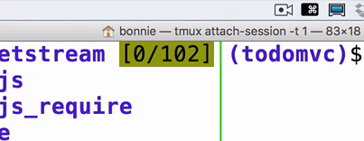
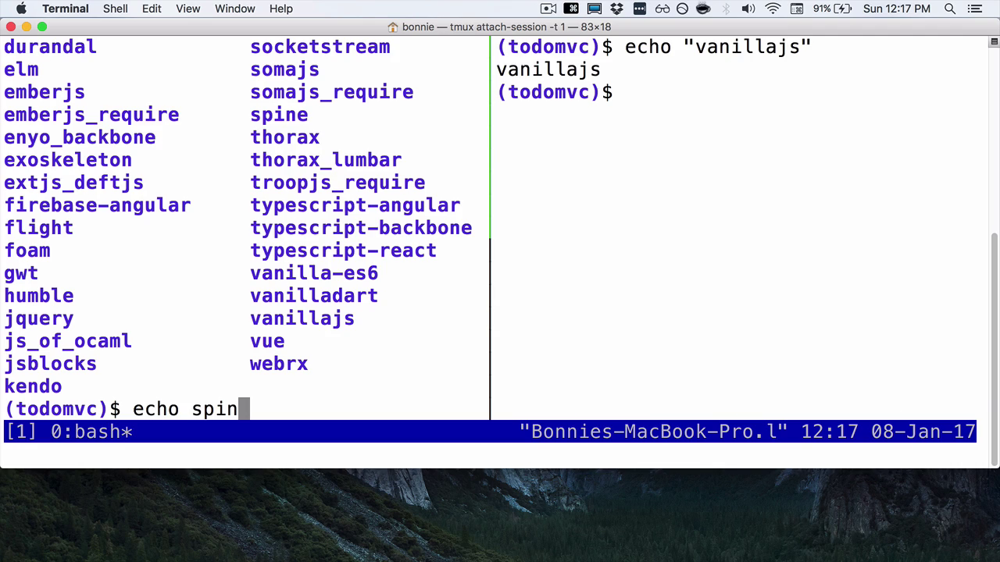

You may have noticed while using tmux that your default method of scrolling doesn't work. In order to scroll back, we're going to type `Control+A` and the `[` key. Remember that I've remapped my prefix key to Control+A. If you haven't done so, you'll still want to use Control+B.

You'll see here that this adds this gold-colored little bit of information display to the top which lets us know that we're in copy mode.

If I use my arrow keys, I can scroll back up and read the previous output from within this tmux pane. To leave copy mode, you press `Q,` no prefix key. That'll bring you right back to your current prompt.

If you're on OS X, your default copy and paste should work. For example, if I highlight "vanillajs" here, push `Command+C`, and type `Control+A` and the right arrow, I should be able to paste that back in with `Command-V` in my other pane.

    (todomvc)$ echo "vanillajs"
    vanillajs
    (todomvc)$

However, especially if you're working on a remote machine, or something that's configured a little bit differently, you'll want to be able to use tmux's native copy and paste capabilities. There are two different sets of key bindings for using copy and paste in tmux. There's Emacs-style key bindings and Vim-style key bindings.

To start with, we'll look at the Emacs key bindings. I'm going to type the prefix key `Control+A` and then `:`, which puts me into command mode. Then I'm going to type `set-window-option`, then `mode-keys`, then `emacs`, and I'm going to hit `Enter`.

In order to copy-paste text, we start by entering copy mode with `Control+A` and the `[`. Then we can use our arrow keys to navigate to something that we want to copy. We set our mark by typing `Control+Space`. Then I can use my arrow keys to select which bit of text I want to copy. To copy it, I'm going to type `Control+W`.

Depending on your system, this might be Alt+W or Option+W. It depends on your Emacs configuration. You'll notice that this takes me out of copy mode and puts me back at the prompt. Now, if I type the prefix key and then `]`, you can see that it copied the text I had selected.

Next, let's look at copy and paste using Vim key bindings. I'm going to type the prefix key and `:` to get into command mode. Then I'm going to type `set-window-option`, then `mode-keys`. Now, I'm going to set it to `vim` instead of Emacs. Just as before, I enter copy mode with the prefix key and then `[`. I can navigate around with my arrow keys. I can also navigate with Vim key bindings.

To set my mark for where I want to start copying, I press `Space`. Again, I use standard Vim navigation to select where I want to copy. Let's say I want to copy to there.

Then in order to actually execute the copy, I press `Enter` to select the copied region. Again, this returns me back to the prompt. Now, if I type the prefix key and then `]`, you can see it copied it to my prompt.

Remember also that you can use your tmux.conf file to change this default behavior. You can set it up to use Emacs- or Vim-style bindings by default, whichever is more comfortable for you.