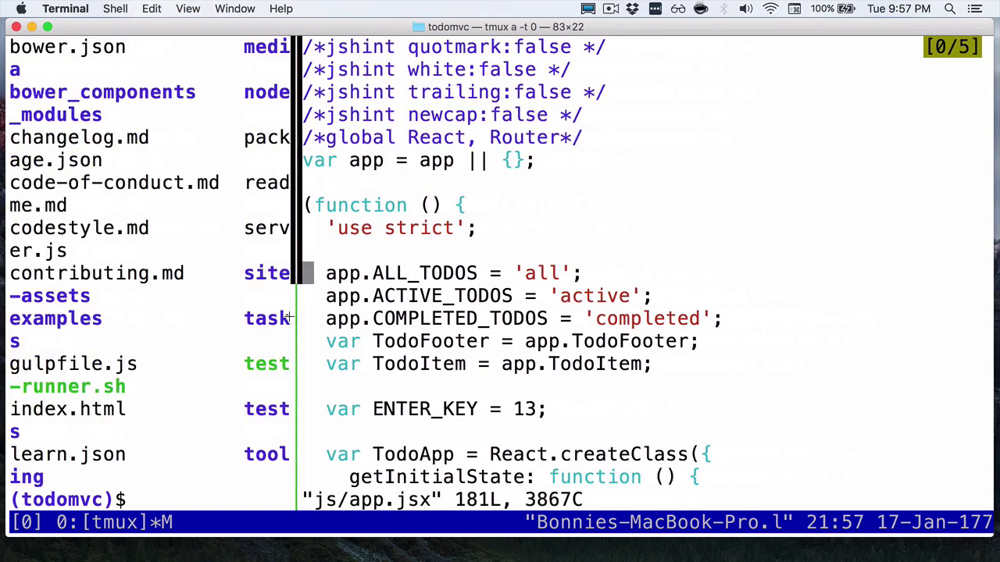
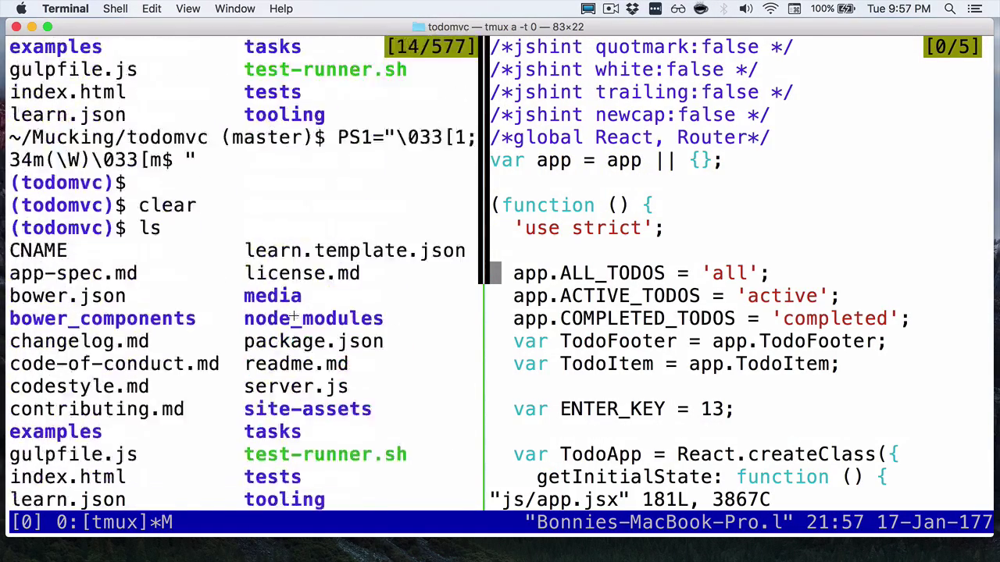
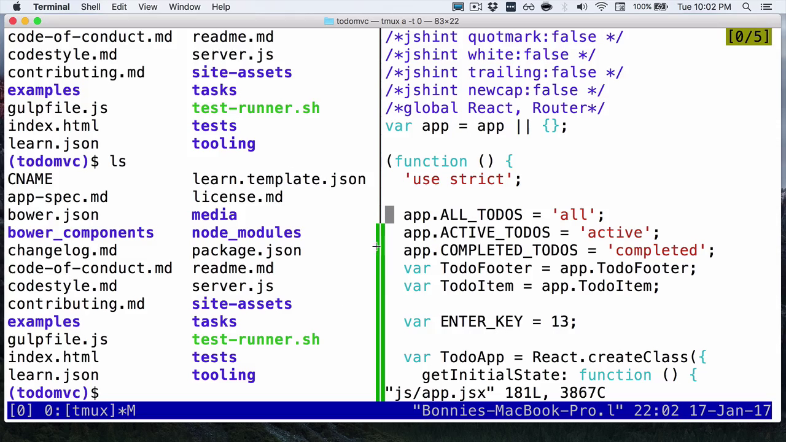
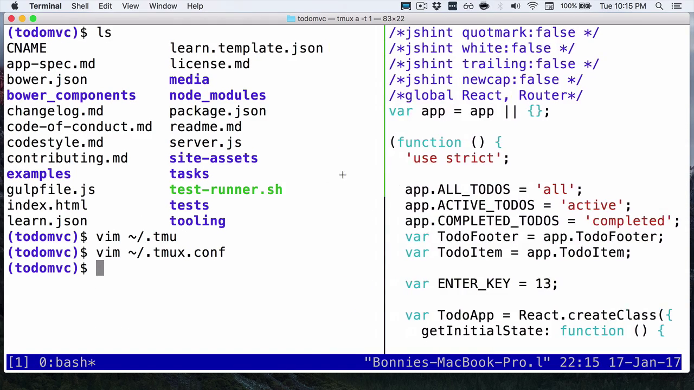

Something you may have noticed about tmux is that with my current setup, I can't actually use my mouse to control anything. When I click between panes, nothing happens.

Some people don't mind that, but for a lot of us it's nice to be able to have mouse control as an option, even if we primarily use keyboard input.

I'm going to type prefix and then `:`. Remember this will either be Control+B or Control+A, if you remapped your keys as we did in the previous lesson. Then I'm going to type `set mouse on`.

Now, you'll see that I can click between panes to change which one is my active one, instead of the other method that we have, which is doing prefix key and then the arrow key to switch between panes.

I can also use my mouse to resize my panes. If I click on the divider bar and then drag, you can see that I can dynamically resize my windows instead of having to specify it again from the command menu in tmux.

One other neat trick, I can finally use the mouse to scroll. Your native scrolling will also work when you have mouse mode on.

The commands for mouse mode changed in version 2.1 from October 2015. If you're using a version earlier than that, you're going to have to enable these three functionalities separately with different commands.

It might be a little bit annoying to always have mouse mode on. As you can see, it means that our cursor changes, and you have this weird highlighting, and you can accidentally screw with your pane barriers.

Let's enable some hot keys to easily turn it on and off. I'm going to open my tmux.conf file using Vim.

    (todomvc)$ vim ~/.tmux.conf

Now let's add another section here. This one is going to be for `Mouse mode keys`. I'm going to bind the lowercase `m` key to set `-g` for global mouse on.

    # Mouse mode keys
    bind m set -g mouse on

Then I'm going to bind the `M` key for set with `-g` for global mouse off.

    bind M set -g mouse off

I'm going to save this. Remember, I have a hotkey for reloading the tmux.config. Now I can do `Control+A R`. It'll reload the config.

Now that we've made that change and reloaded our config, you can see right now I'm still in mouse mode. I can resize the pane with my cursor.

If I type `Control+A M`, I'm no longer in mouse mode. This is no longer effective. I can get back into mouse mode with `Control+A M`.

Having these shortcuts is just a nicety, but you might find that you want to add them. If so, feel free to edit your tmux.conf file.