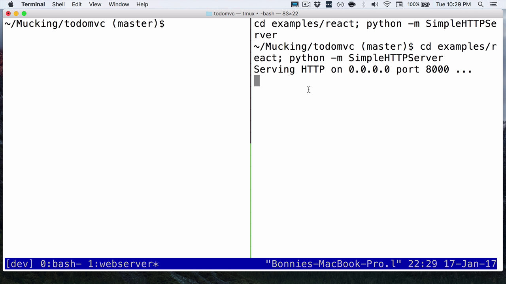

If you often find yourself wanting to create the same kind of tmux set up -- say you always want the same layout when you're working on a project -- tmux scripting can be a really powerful tool.

You already know that we can use tmux from the command line in order to create panes, organize windows, things like that. Now we're going to put that together into a script. I'm going to create a file called `tmux-launch.sh`. Then I'm going to make it executable.

    (todomvc)$ touch tmuxlaunch.sh
    (todomvc)$ chmod u+x tmuxlaunch.sh

Now that we've done that, let's edit it.

The first thing I'm going to do is I'm going to make a variable called `SESSION`. This is going to be what we name our session, and we'll need to refer to it later, so this lets us change our mind later on, if we want.

To start with, I'm going to create a new session by running `tmux new-session -d`, so we start in detach mode, so that the rest of the script can run, and then `-s`, and we'll name the session. This is where we will use the variable we created above.

    SESSION=dev
    tmux new-session -d -s $SESSION

Next, let's create a new window within our session. We're going to do that by typing `tmux new-window`, now we'll use `-t`, and we're going to do `$SESSION`, and then 1`.` This is going to be our window number 1, and then `-n`. We're going to give it a name. I'm going to call this `webserver`.

    tmux new-window -t $SESSION:1 -n 'webserver'

This is the window that we're going to use to keep a web server running while we develop a project. Before I forget, let's just put that in some quotes. All right, let's test this to make sure it's working as I expect.

I'm going to run `sh`, and then `tmuxlaunch.sh`. If I type `tmux ls`, you can see that we have a session named dev running with tmux.

    dev: 2 windows (created Tue Jan 17 22:23:19 2017) [83x21]

I can attach to that by running `tmux attach -t`, and then the name of the session, which is `dev`.

    (todomvc)$ tmux attach -t dev

You can see we've got our two windows here just like we expect, one for Bash and one that's called webserver because we named it in our script.

Let's keep going. We're going to open tmuxlaunch again. The next thing I want to do is I want to configure this window a little bit. We're going to do `tmux` and then `select-window`. We're going to set the target to be the first window in our session. Again, `SESSION:1`.

    tmux select-window -t $SESSION:1

Now, our subsequent commands will affect this window. I can do `tmux split-window`. Let's say we want a horizontal split, so I'll do `-h`. Remember, we're working in this todomvc project.

Let's say I want to launch the web server in one of the examples. I'm going to do `tmux send-keys` to send these commands to the tmux window we selected. Then I'm going to type `'cd examples/react; python-m SimpleHTTPServer'`.

Then, and here's the important part, I have to end this with a capital `C-m`, which will send Enter keystroke. Finally, another useful thing that we're going to want to do is attach to the sessions.

We'll do `tmux attach -t` and then the session name.

    tmux attach -t $SESSION

All right, let's give this a try. I'm going to quit out of Vim. I'm going to look at my currently running tmux sessions, and kill the one from when we were testing this before, so `kill session -t dev`. Now, let's try our script.

I type `./tmuxlaunch.sh`. As you can see, here we go. We are split into todomvc directory, and then we also have the Python server running right there for us when we start up.

Obviously, you can get really complicated with this, and tune it as much as you need to your workflow.

You can set up many different windows. You can start many different processes in the background, depending on what you need for your development. Just remember that any amount of configuration you can do within tmux, you can usually do from the command line, and therefore you can script it, too.