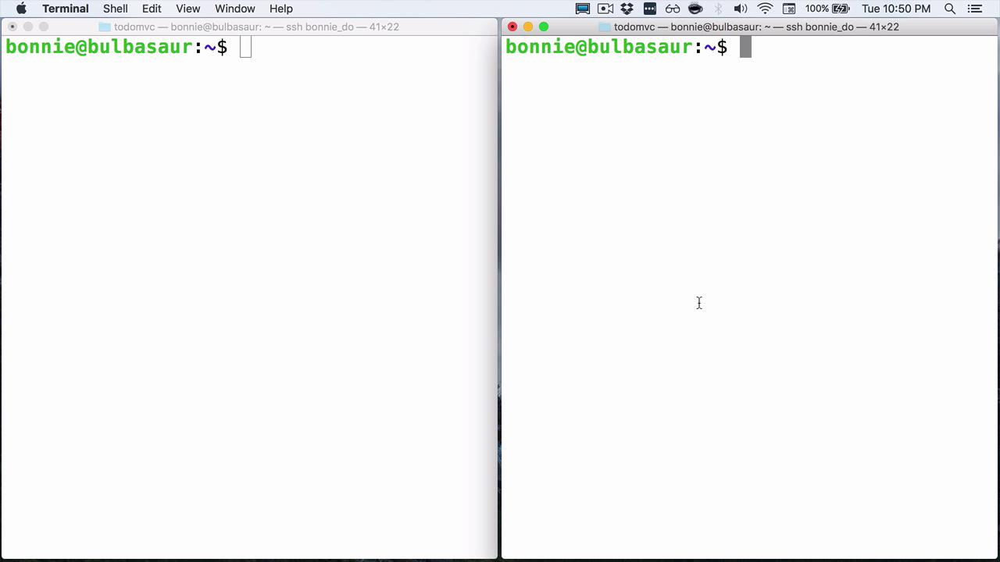
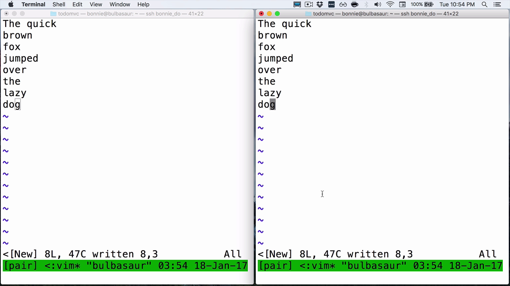

One of the really neat things that you can use tmux for is pair programming. You can see right here I have two terminal windows open. They're both SSHed into the same server.



I'm using a simple DigitalOcean Droplet. You can, of course, set up SSH with your pair programmer however you want, whether that's with another server, or with one of your laptops, whichever works best for you.

The neat thing here is that in one of these windows, we can type `tmux new session -s pair`, and it'll launch a tmux session. So far, so good. This is a pretty ordinary thing to do.

```bash
echo "oh hello"
oh hello
```

But if I go into the other window, I can run `tmux ls`, and I can see that there is a tmux session here, which I can also attach to.

    bonnie@bulbasaur:~$ tmux ls
    pair: 1 windows (created Wed Jan 18 03:51:34 2017) [41x21 (attached)

I'm going to type `tmux a`, which is a shortcut for attach, `-t pair`.

    bonnie@bulbasaur:~$ tmux a -t pair

Now, both of these windows, they are separate SSH sessions, and they are attached to the same tmux session. Commands, the pane setup, all of that stuff will be reflected in both. For example, I can do a pane split with `Control+B %`, and we see that both sessions reflect the split.


Let's go back down to one pane. I'm going to do `Control+D` to close that extra one. Let's go into vim.

    bonnie@bulbasaur:~$ vim foo.tx

This is where it starts to get really cool for pair programming. I can do the `quick brown fox jumped over the lazy dog`. Obviously, you're going to be wanting to write something a little bit more substantial.

The cool thing here is that this happens with barely any lag, and not only do you get to see my code update live, you also get to follow my cursor. You can see how I'm navigating and all of that.



Again, this doesn't require any fancy configurations or changes to how you use tmux. You both just have to be sharing the same session.