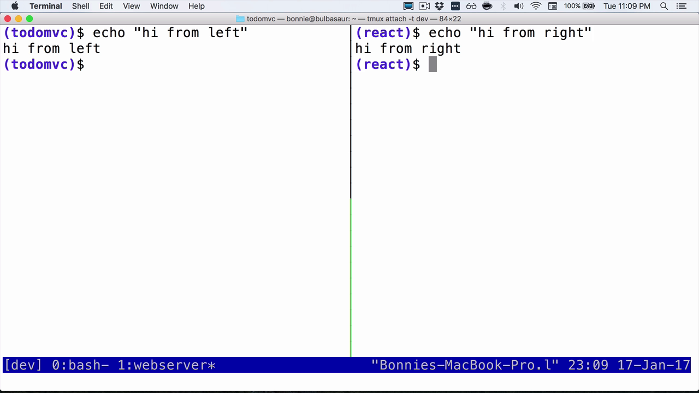
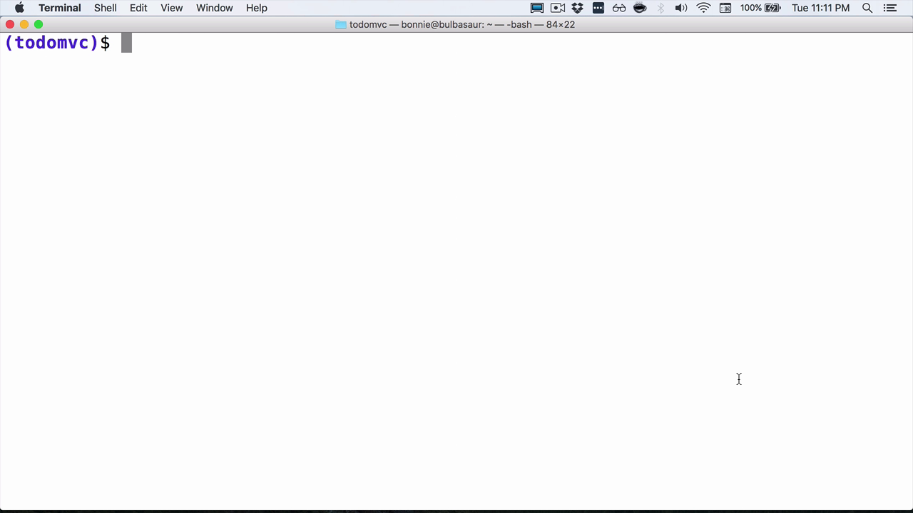
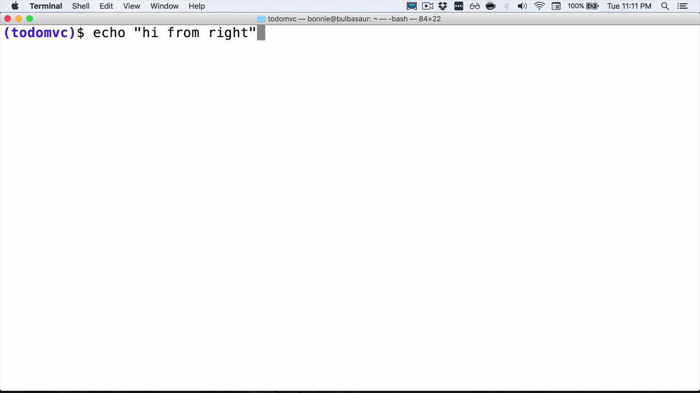

One of the occasionally annoying things you may have noticed is that your history in different tmux windows and panes isn't shared between them. Luckily, this is a pretty easy fix. Before we begin, let's confirm that shared history doesn't work.

I'm going to type `echo "from pane 1"` in the first pane. In the next pane, I'm going to type `echo "from pane 2"`. We can see that if I tab up and go through my history, we don't see the echo "from pane 1" in this pane. To fix this, we're going to edit our Bash RC file.

    (react)$ vim ~/.bashrc

Depending on your system configuration, of course, you might want your Bash RC file or your Bash profile, whatever the config is for the shell you're using. I'm going to zoom in on this with the prefix `Z` so that we can just look at this file. I'm assuming that you're using Bash.

We're going to set `shopt -s` to enable. We're going to enable `histappend`, which means append history, don't overwrite it. We're also going to set `histreedit`, and also `histverify`.
```bash
shopt -s histappend
shopt -s histreedit
shopt -s histverify
```

These two options make sure that if editing fails due to a raise condition or something like that, we're going to try and recover from it and redo the edit.

Next, we're going to set another magical value. This one is called `HISTCONTROL`. I'm going to set this to `'ignoreboth'`.

```bash
HISTCONTROL='ignoreboth'
```

What ignoreboth does is, is it ignores commands that start with whitespace, as well duplicate commands. We don't want to add those to our history. That's extra junk.

Finally, the real magic happens when we set `PROMPT_COMMAND`. Let me add the underscore there. To start with, we're going to do `history -a`, which appends to history, and then `history -c`, which clears history. Then finally, `history -r`, which reads from history. Then again, `PROMPT_COMMAND`.

```bash
PROMPT_COMMAND = "history -a; history -c;history -r; $PROMPT_COMMAND"
```

PROMPT_COMMAND is this magical value. It contains a command that gets executed right before your prompt is displayed, i.e., after your last command finished. Because of that, we can hook into here to update your history and make sure that it gets synched between different tabs, different tmux sessions, that sort of thing.

Let's save this file. Now, let's try to source our `.bashrc`.

    (react)$ source ~/.bashrc
    -bash: shopt: histreddit: invalid shell option name

Oops, that is a simple fix. History re-edit, not history reddit. Let's try that again. We've sourced our `.bashrc` in that pane. Let's go into our other pane, and also source the `.bashrc`.

    (react)$ source ~/.bashrc

Now, let's try our test again.

In my left-hand pane, I'm going to say `"hi from left"`. In my right-hand pane, I'm going to say `"hi from right"`.



Now, if I go up, I see my last command, and then also my other one. Indeed, if I detach from tmux completely, now I'm back in my shell. I am out of tmux.



If I scroll up, you can see that the echo commands I ran from within my tmux session are now available in my history outside of tmux.

